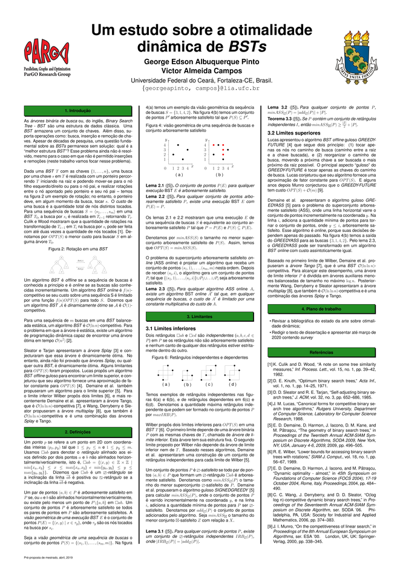

### :man_student: Pré-proposta de dissertação

Pré-proposta de dissertação apresentada ao Curso de Mestrado Acadêmico em Ciência da Computação do Programa de Pós-Graduação em Ciência da Computação do Centro de Ciências da Universidade Federal do Ceará, como requisito parcial à obtenção do título de mestre em Ciência da Computação.

#### :teacher: Banca examinadora
- Prof. Dr. Victor Almeida Campos (Orientador) - Universidade Federal do Ceará (UFC)
- Prof. Dr. Prof. Dr. Manoel Bezerra Campêlo Neto - Universidade Federal do Ceará (UFC)
- Prof. Dra. Cláudia Linhares Sales - Universidade Federal do Ceará (UFC)

:mag: [Ver pôster](poster.pdf)