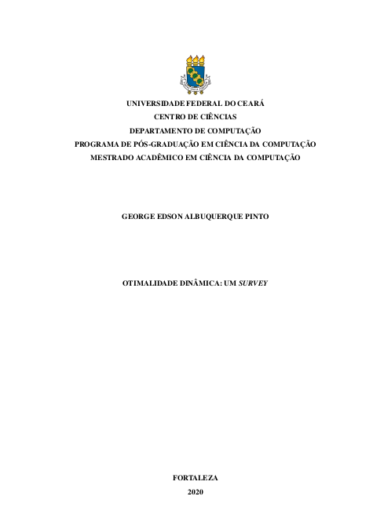

### :man_student: Proposta de dissertação

Proposta de dissertação apresentada ao Curso de Mestrado Acadêmico em Ciência da Computação do Programa de Pós-Graduação em Ciência da Computação do Centro de Ciências da Universidade Federal do Ceará, como requisito parcial à obtenção do título de mestre em Ciência da Computação.

#### :teacher: Banca examinadora
- Prof. Dr. Victor Almeida Campos (Orientador) - Universidade Federal do Ceará (UFC)
- Prof. Dr. Prof. Dr. Manoel Bezerra Campêlo Neto - Universidade Federal do Ceará (UFC)
- Prof. Dr. Carlos Vinícius Gomes Costa Lima - Universidade Federal do Ceará (UFC)
- Prof. Dr. Francicleber Martins Ferreira - Universidade Federal do Ceará (UFC)
- Prof. Dr. Nicolas de Almeida MartinsUniversidade da Integração Internacional da Lusofonia Afro-Brasileira (UNILAB)

#### Resumo
As Árvores Binária de Busca (*BSTs*) são uma das estruturas de dados clássica para a Ciência da Computação e que, apesar de ser uma estrutura de dados simples, possui muitas questões em aberto depois de décadas de pesquisa. A principal questão em aberto sobre *BSTs* ainda permanece sem solução: "Qual é a melhor Árvore Binária de Busca?". Em 1983 Sleator e Tarjan [1] propuseram a Árvore *Splay* e conjecturaram que o custo para realizar qualquer sequência de buscas *S* nesta *BST* é tão bom, assintoticamente, quanto o menor custo possível, denotado por *OPT(S)*. Esta é a famosa conjectura da otimalidade dinâmica, onde qualquer *BST* que realiza qualquer sequência de buscas *S* com custo *O(OPT(S))* é dita dinamicamente ótima. Desde que a conjectura foi proposta houveram muitas tentativas de prová-la, mas ainda não foi provado que a Árvore *Splay*, ou qualquer outra *BST*, é dinamicamente ótima. O melhor custo conhecido é *O(log log n OPT(S))* da Árvore Tango proposta por Demaine et *al.* [2], e das árvores *Multi-Splay Tree* [3] e *Chain-Splay Tree* [4] e *Chain-Splay Tree* [5]. Através do estudo de *BSTs*, Demaine et *al.* [6] propuseram um problema de pontos no plano que equivale ao problema de busca em uma *BST*. Este é resultado surpreendente, pois é uma maneira mais fácil de visualizar com uma execução *BST*. Finalmente, esta dissertação trata-se de um *survey* da literatura sobre a otimalidade dinâmica, onde reunimos os principais resultado relacionados ao problema.
###### Palavras-chave: Árvore Binária de Busca. Otimalidade dinâmica. Estrutura de dados. Limitantes.

#### Abstract
Binary Search Trees (*BST*) are one of the classic data structures for Computer Science and which, despite being a simple data structure, has many open questions after decades of research. The main open question about *BST* still remains unsolved: "What is the best Binary Search Tree?". In 1983 Sleator e Tarjan [1] proposed the *Splay* Tree and conjectured that the cost of performing any search sequence *S* in this *BTS* is as good, asymptotically, as the lowest possible cost, denoted by *OPT(S)*. This is the famous conjecture of dynamic optimality, where any *BTS* that performs any search sequence *S* with cost *O(OPT(S))* is said to be dynamic optimal. Since the conjecture was proposed, there have been many attempts to prove it, but it has not yet been proven that the *Splay* Tree, or any other *BTS*, is dynamic optimal. The best known cost is *O(log log n OPT(S))* from the *Tango* Tree proposed by Demaine et *al.* [2], and from the *Multi-Splay Tree* [3], *Chain-Splay Tree* [4] and *Chain-Splay Tree* [5]. Through the study of *BST*, Demaine et *al.* [6] proposed a problem of points in the plane that is equivalent to the search problem in a *BTS*. This is a surprising result, beacause it is an easier way to visualize a *BTS* execution. Finally, this dissertation is a survey of the literature on dynamic optimality, where we bring together the main results related to the problem.
###### Keywords: Binary Search Tree. Dynamic Optimality. Data structure. Bounds.

#### Sumário
1. **INTRODUÇÃO**
2. **ÁRVORES BINÁRIA DE BUSCA E SEUS MODELOS**
    1. Árvore Binária de Busca (*BST*)
    2. Modelo *BST*
3. **ESTUDO DO PROBLEMA**
    1. Problema estático
    2. Problema dinâmico
        1. Problema *offline*
        2. Problema *online*
    2. Análise competitiva em *BST*
    3. A Conjectura da Otimalidade Dinâmica
4. **VISÃO GEOMÉTRICA**
    1. Definição
    2. O Problema do Superconjunto arboreamente satisfeito *ArbSS*
    3. Equivalência entre execução *BST* e *ArbSS*
5. **LIMITANTES**
    1. Limites superiores
    2. Limites inferiores
6. **RESULTADOS RECENTES**
    1. Aproximação com Programação Linear
    2. Monotonicidade
7. **CONCLUSÕES E TRABALHOS FUTUROS**
8. **REFERÊNCIAS**

:mag: [Ver proposta completa](proposta.pdf)